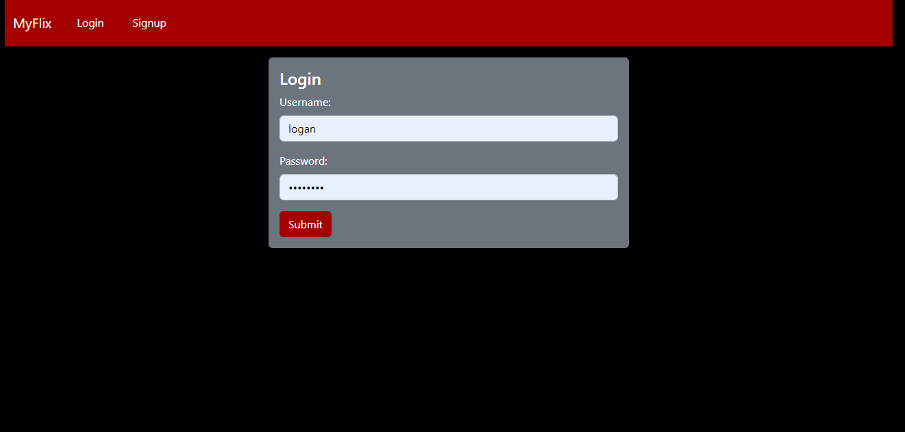
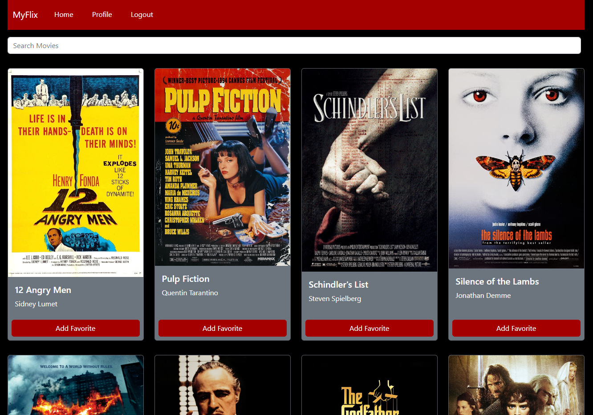
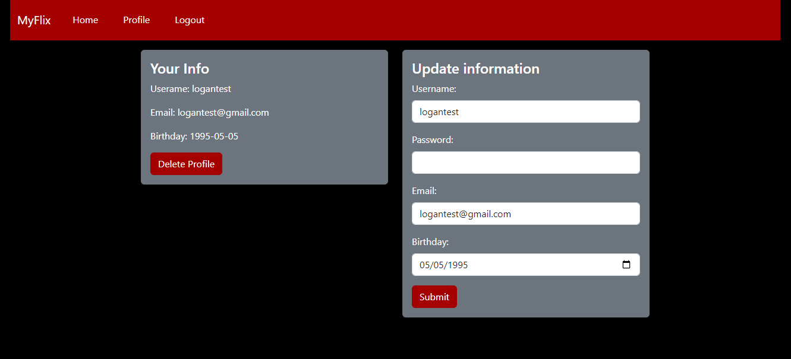

# MyFlix React

This React client is hosted on [Netlify](https://my-flix-logan.netlify.app/).

This project was built with Parcel 2.8.3.

## Description

This is the client side for the full stack MyFlix web application (here is the [Angular](https://github.com/loganjlevin/myFlix-Angular) version). The MyFlix web app provides users with access to information about different movies, directors, and genres. Users are able to sign up, view a list of all the movies stored in the database, search for a specific movie, update their personal information, and create a list of their favorite movies.

## Features

- Display a list of all movies to the client
- Display data about a single movie to the client including description, director, genre, image url
- Display the description of a genre
- Display data about director including bio, birth year, death year
- Register a new user
- Update an existing user's information (username, password, email, birthday)
- Add and remove a movie from a user's list of favorites
- Delete an existing user's profile

## Technologies

- React 18.2.0
- Boostrap 5.2.3
- React Router 6.8.2

## Screenshots

---

---

